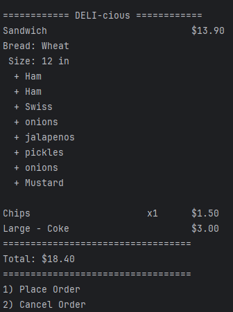

# 🥪 DELI-cious Sandwich Shop 

A terminal-based Java app that lets users create fully customized sandwich orders with toppings, drinks, and chips. Users can loop through menu options, view dynamic receipts with pricing, and generate timestamped `.txt` receipt files. Great for practicing OOP concepts like inheritance, interfaces, abstract classes, and file I/O.

<details>
<summary>🚀 Features</summary>

- Loop-based user input for smooth menu navigation
- Customizable sandwiches with meats, cheeses, sauces, and sides
- Premium toppings and extra add-ons with size-based pricing
- Auto-formatted terminal receipts
- Writes each receipt to a timestamped `.txt` file
- Polymorphic printing using an interface (`Printable`)
- Dynamic price calculation
</details>

---

## 📦 Classes Overview

<details>
<summary><code>Main.java</code></summary>
Starts the app and displays the home screen with the option to create or exit orders.
</details>

<details>
<summary><code>Order.java</code></summary>
Handles the user interaction menus (adding sandwich, chips, drinks, checkout) and manages the cart.
</details>

<details>
<summary><code>Sandwich.java</code></summary>
Represents a sandwich object, holding size, bread type, toppings, and sides. Calculates price and prints receipt.
</details>

<details>
<summary><code>Drink.java</code></summary>
Represents a drink with size and flavor. Implements custom receipt formatting.
</details>

<details>
<summary><code>Chips.java</code></summary>
Handles quantity and pricing for chips. If added multiple times, quantity increases and price reflects it.
</details>

<details>
<summary><code>Topping.java</code></summary>
Used for sandwich toppings. Tracks name, whether it’s premium, and whether it’s marked as "extra".
</details>

<details>
<summary><code>AllToppings.java</code></summary>
Holds static lists of all meats, cheeses, sauces. Used to validate toppings during input.
</details>

<details>
<summary><code>Printable.java (Interface)</code></summary>
Any item that needs to print itself on a receipt must implement this.
</details>

<details>
<summary><code>MenuItem.java (Abstract Class)</code></summary>
Base class for all cart items. Forces them to have <code>calculatePrice()</code> and <code>printReceipt()</code>.
</details>

<details>
<summary><code>ReceiptWriter.java</code></summary>
Generates a new receipt text file using the current timestamp as the filename.
</details>

---

## 🖼️ Preview

<!-- Replace 'receipt.png' with the filename of your screenshot -->


---

## 🔥 Favorite Line of Code

```java
System.out.printf("%-30s $%.2f\n", "Sandwich", calculatePrice());
```
This line formats the different items and its price in the receipt like a real receipt would.

## 👤 Author

**Joshua Manzano**  
Year Up Software Development Program  
Capstone Project – 2025 
